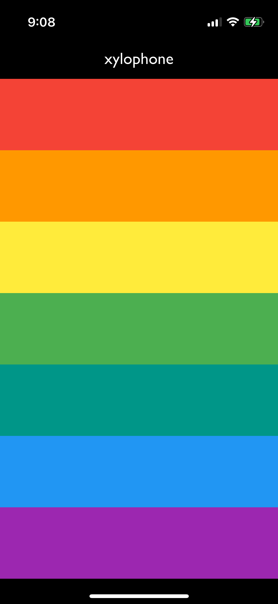

# PA4 Xylophone

<figure><figcaption></figcaption></figure>

<pre class="language-dart"><code class="lang-dart">import 'package:flutter/material.dart';
<strong>import 'package:just_audio/just_audio.dart';
</strong>
void main() => runApp(MyApp());

class MyApp extends StatefulWidget {
  const MyApp({super.key});

  @override
  State&#x3C;MyApp> createState() => _MyAppState();
}

class _MyAppState extends State&#x3C;MyApp> {
<strong>  late List&#x3C;AudioPlayer> players;
</strong>
  final List&#x3C;Color> colors = [
    Colors.red,
    Colors.orange,
    Colors.yellow,
    Colors.green,
    Colors.teal,
    Colors.blue,
    Colors.purple,
  ];
  
  @override
<strong>  void initState() {
</strong><strong>    super.initState();
</strong><strong>    players = List.generate(7, (_) => AudioPlayer());
</strong><strong>  }
</strong>
  @override
<strong>  void dispose() {
</strong><strong>    for (var player in players) {
</strong><strong>      player.dispose();
</strong><strong>    }
</strong><strong>    super.dispose();
</strong>  }

  @override
  Widget build(BuildContext context) {
    return MaterialApp(
      debugShowCheckedModeBanner: false,
      home: Scaffold(
        backgroundColor: Colors.black,
        appBar: AppBar(
          title: Text('xylophone', style: TextStyle(fontFamily: 'Gill Sans')),
          backgroundColor: Colors.black,
          foregroundColor: Colors.white,
        ),
        body: SafeArea(
          child: Center(
            child: Column(
              crossAxisAlignment: CrossAxisAlignment.stretch,
              children: List.generate(
                7,
                (index) => Expanded(
                  child: TextButton(
                    style: TextButton.styleFrom(
                      backgroundColor: colors[index],
                      foregroundColor: Colors.white,
                      shape: RoundedRectangleBorder(
                        borderRadius: BorderRadius.zero,
                      ),
                    ),
<strong>                    onPressed: () async {
</strong><strong>                      await players[index].setAsset('assets/note${index + 1}.wav');
</strong><strong>                      players[index].play();
</strong><strong>                    },
</strong>                    child: const SizedBox.shrink(),
                  ),
                ),
              ),
            ),
          ),
        ),
      ),
    );
  }
}

</code></pre>

如何理解 <code>late</code> 关键字？

`late` 是 Dart 的一个修饰符，用来告诉编译器：“我保证这个变量在真正被使用之前一定会赋值，但我现在还不想（或不能）立即赋值。”

如何理解 <code>initState()</code> 函数和 <code>dispose()</code> 函数？

`initState()` 和 `dispose()` 函数是 Dart 的生命周期函数。它们存在的意义可以类比于 C++ 中的构造函数和析构函数。&#x20;

由此可以理解两个函数的语义：先依据父类的 `initState()` 构造方法对父类 `State<T>` 进行构造（使用 `super` 方法），再构造子类的 `player` 对象；\
析构时，则先销毁子类构造的 `player` 对象，再依据父类的 `dispose` 析构父类 `State<T>`

⚠️：虽然可以将 `initState()` 和 `dispose()` 看作 Dart 的构造/析构函数，但 Dart 里真正的构造函数是 `MyApp()`（Widget 或对象构造时运行），而 `initState()` 属于 State 生命周期的一部分。

如何理解 <code>super</code>?

`super` 属于继承中的概念。使用 `super` 可以访问父类中的方法或属性。

如何理解 <code>onPressed()</code> 函数中 <code>async</code> 关键字和 <code>await</code> 关键字的用法？

`async` 作为一个异步函数的标记，指示其中有异步操作。

而 `await` 作为该异步操作的标记，告知编译器：“等这个 `Future` 执行完毕，我再继续执行下一句”。

在上述代码中，`await player1.setAsset('assets/note1.wav')` 被标记为异步操作，因为 `setAsset` 是一个返回 `Future` 的函数，需要等待文件加载完成，才能执行下一句（`player1.play()`）。

如果不加 `await`，程序就会马上执行 `play()`，这时候可能播放器还没准备好，就会出错。

⚠️：`Future` 是 Dart 的异步返回值类型。

## APPENDIX

### assets


