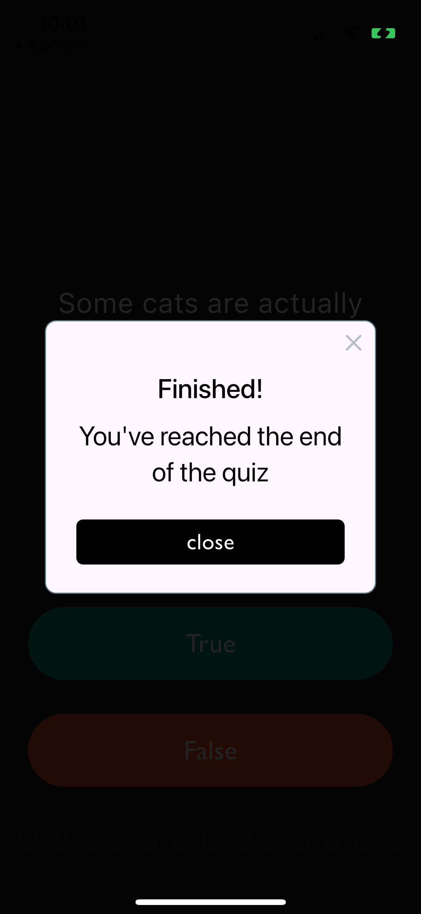
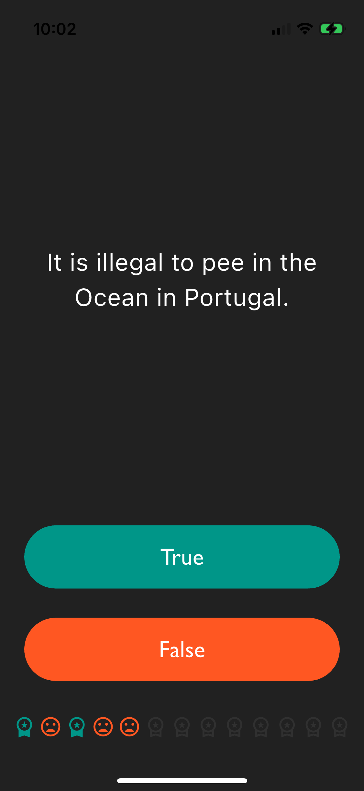

# PA5 Quizzler

<div><figure><figcaption></figcaption></figure> <figure><figcaption></figcaption></figure></div>



```dart
import 'package:flutter/material.dart';
import 'quiz_brain.dart';
import 'score_band.dart';

void main() => runApp(MyApp());

class MyApp extends StatelessWidget {
  const MyApp({super.key});

  @override
  Widget build(BuildContext context) {
    return MaterialApp(
      debugShowCheckedModeBanner: false,
      home: Scaffold(
        backgroundColor: Colors.grey.shade900,
        body: SafeArea(
          child: Padding(
            padding: EdgeInsets.symmetric(horizontal: 10.0),
            child: QuizPage(),
          ),
        ),
      ),
    );
  }
}

class QuizPage extends StatefulWidget {
  @override
  QuizPageState createState() => QuizPageState();
}

class QuizPageState extends State<QuizPage> {
  ScoreBand scoreKeeper = ScoreBand();
  QuizBrain quizBrain = QuizBrain();

  void reply(bool userChoose) {
    setState(() {
      if (userChoose == quizBrain.checkAnswer()) {
        scoreKeeper.setScore(quizBrain.getNum(), true);
      } else {
        scoreKeeper.setScore(quizBrain.getNum(), false);
      }

      quizBrain.nextQuiz(context);
      if (quizBrain.BeginFlag) {
        scoreKeeper.setNewBand();
        quizBrain.BeginFlag = false;
      }
    });
  }

  @override
  Widget build(BuildContext context) {
    return Column(
      mainAxisAlignment: MainAxisAlignment.spaceBetween,
      crossAxisAlignment: CrossAxisAlignment.stretch,
      children: <Widget>[
        Expanded(
          flex: 5,
          child: Padding(
            padding: EdgeInsets.all(10.0),
            child: Center(
              child: Text(
                quizBrain.getQuestion(),
                textAlign: TextAlign.center,
                style: TextStyle(fontSize: 25.0, color: Colors.white),
              ),
            ),
          ),
        ),
        Expanded(
          child: Padding(
            padding: EdgeInsets.all(15.0),
            child: TextButton(
              style: TextButton.styleFrom(
                backgroundColor: Colors.teal,
                foregroundColor: Colors.white,
              ),
              child: Text(
                'True',
                style: TextStyle(
                  color: Colors.white,
                  fontSize: 24.0,
                  fontFamily: 'Gill Sans',
                ),
              ),
              onPressed: () {
                reply(true);
                //The user picked true.
              },
            ),
          ),
        ),
        Expanded(
          child: Padding(
            padding: EdgeInsets.all(15.0),
            child: TextButton(
              style: TextButton.styleFrom(backgroundColor: Colors.deepOrange),
              child: Text(
                'False',
                style: TextStyle(
                  fontSize: 24.0,
                  color: Colors.white,
                  fontFamily: 'Gill Sans',
                ),
              ),
              onPressed: () {
                reply(false);
                //The user picked false.
              },
            ),
          ),
        ),
        Padding(
          padding: const EdgeInsets.symmetric(vertical: 20),
          child: Row(
            mainAxisAlignment: MainAxisAlignment.spaceEvenly,
            children: scoreKeeper.showScoreBand(),
          ),
        ),
      ],
    );
  }
}

```



```dart
class Question {
  String q;
  bool a;

  Question(this.q, this.a);
}

// More Normal Way to create a Class
// constructor: 
// Question({String text1, bool text2}) {q = text1, a = text2};

// new object:
// Question q1 = Qustion(text1: '...', text2: true);
```



```dart
import 'package:flutter/material.dart';
import 'question.dart';
import 'package:rflutter_alert/rflutter_alert.dart';

class QuizBrain {
  int _num = 0;
  bool BeginFlag = false;

  List<Question> _quizBank = [
    Question('Some cats are actually allergic to humans', true),
    Question('You can lead a cow down stairs but not up stairs.', false),
    Question('Approximately one quarter of human bones are in the feet.', true),
    Question('A slug\'s blood is green.', true),
    Question('Buzz Aldrin\'s mother\'s maiden name was \"Moon\".', true),
    Question('It is illegal to pee in the Ocean in Portugal.', true),
    Question(
      'No piece of square dry paper can be folded in half more than 7 times.',
      false,
    ),
    Question(
      'In London, UK, if you happen to die in the House of Parliament, you are technically entitled to a state funeral, because the building is considered too sacred a place.',
      true,
    ),
    Question(
      'The loudest sound produced by any animal is 188 decibels. That animal is the African Elephant.',
      false,
    ),
    Question(
      'The total surface area of two human lungs is approximately 70 square metres.',
      true,
    ),
    Question('Google was originally called \"Backrub\".', true),
    Question(
      'Chocolate affects a dog\'s heart and nervous system; a few ounces are enough to kill a small dog.',
      true,
    ),
    Question(
      'In West Virginia, USA, if you accidentally hit an animal with your car, you are free to take it home to eat.',
      true,
    ),
  ];
  late List<int> statis;
  QuizBrain() {
    statis = List<int>.filled(_quizBank.length, 0);
  }

  void nextQuiz(BuildContext context) {
    if (_num < getLength() - 1) {
      _num++;
    } else {
      Alert(
        context: context,
        title: "Finished!",
        desc: "You've reached the end of the quiz",
        buttons: [
          DialogButton(
            color: Colors.black,
            onPressed: () => Navigator.pop(context),
            child: Text(
              'close',
              style: TextStyle(
                color: Colors.white,
                fontFamily: 'Gill Sans',
                fontSize: 20,
              ),
            ),
          ),
        ],
      ).show();
      BeginFlag = true;
      _num = 0;
    }
  }

  int getNum() {
    return _num;
  }

  String getQuestion() {
    return _quizBank[_num].q;
  }

  bool checkAnswer() {
    return _quizBank[_num].a;
  }

  int getLength() {
    return _quizBank.length;
  }
}

```



```dart
import 'package:flutter/material.dart';

class ScoreBand {
  late List<Icon> _scoreBand = List.filled(13, getEmptyIcon());

  void setNewBand() {
    _scoreBand = List.filled(13, getEmptyIcon());
  }

  Icon getEmptyIcon() {
    return Icon(Icons.workspace_premium_outlined, color: Colors.grey[850]);
  }

  Icon getGoodIcon() {
    return Icon(Icons.workspace_premium_sharp, color: Colors.teal);
  }

  Icon getBadIcon() {
    return Icon(Icons.mood_bad, color: Colors.deepOrange);
  }

  List<Icon> showScoreBand() {
    return _scoreBand;
  }

  void setScore(int num, bool flag) {
    _scoreBand[num] = flag ? getGoodIcon() : getBadIcon();
  }
}

```


