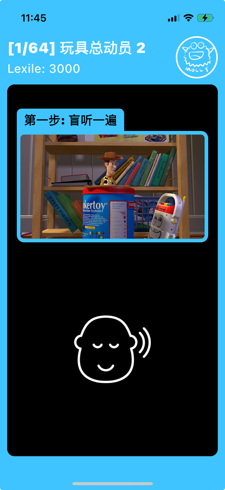

# 1 First Page

第一个实现的静态界面：英语跟读

<figure><figcaption></figcaption></figure>

```dart
import 'package:flutter/material.dart';

void main() {
  runApp(MyApp());
}

class MyApp extends StatelessWidget {
  const MyApp({super.key});

  @override
  Widget build(BuildContext context) {
    return MaterialApp(
      debugShowCheckedModeBanner: false,
      home: Scaffold(
        backgroundColor: Colors.lightBlueAccent,
        body: SafeArea(
          child: Padding(
            padding: const EdgeInsets.symmetric(horizontal: 12),
            child: Column(
              children: [
                Container(
                  padding: EdgeInsets.only(top: 10, bottom: 10),
                  // height: 100,
                  color: Colors.lightBlueAccent,
                  child: Row(
                    mainAxisAlignment: MainAxisAlignment.spaceBetween,
                    crossAxisAlignment: CrossAxisAlignment.center,
                    spacing: 10,
                    children: [
                      Column(
                        mainAxisAlignment: MainAxisAlignment.center,
                        crossAxisAlignment: CrossAxisAlignment.start,
                        spacing: 4,
                        children: [
                          Text(
                            '[1/64] 玩具总动员 2',
                            style: TextStyle(
                              color: Colors.white,
                              fontSize: 24,
                              fontFamily: 'Inter',
                              fontWeight: FontWeight.w900,
                            ),
                          ),
                          Text(
                            'Lexile: 3000',
                            style: TextStyle(
                              color: Colors.white,
                              fontFamily: 'Inter',
                              fontSize: 20,
                              fontWeight: FontWeight.w500,
                            ),
                          ),
                        ],
                      ),
                      Image(
                        image: AssetImage('images/monster.png'),
                        height: 70,
                      ),
                    ],
                  ),
                ),
                Container(
                  height:
                      MediaQuery.of(context).size.height -
                      MediaQuery.of(context).padding.top -
                      MediaQuery.of(context).padding.bottom -
                      kToolbarHeight -
                      kBottomNavigationBarHeight,
                  decoration: BoxDecoration(
                    color: Colors.black,
                    borderRadius: BorderRadius.circular(12),
                  ),
                  child: Padding(
                    padding: const EdgeInsets.symmetric(horizontal: 16),
                    child: Column(
                      children: [
                        Column(
                          crossAxisAlignment: CrossAxisAlignment.start,
                          children: [
                            Container(
                              padding: EdgeInsets.symmetric(
                                vertical: 4,
                                horizontal: 12,
                              ),
                              margin: EdgeInsets.only(top: 40),
                              decoration: BoxDecoration(
                                color: Colors.lightBlueAccent,
                                borderRadius: BorderRadius.only(
                                  topLeft: Radius.circular(8),
                                  topRight: Radius.circular(8),
                                ),
                              ),
                              child: Text(
                                '第一步: 盲听一遍',
                                style: TextStyle(
                                  color: Colors.black,
                                  fontSize: 20,
                                  fontWeight: FontWeight.w900,
                                ),
                              ),
                            ), // Container for "Text"
                            Container(
                              decoration: BoxDecoration(
                                color: Colors.lightBlueAccent,
                                borderRadius: BorderRadius.only(
                                  topRight: Radius.circular(12),
                                  bottomLeft: Radius.circular(12),
                                  bottomRight: Radius.circular(12),
                                ),
                                border: BoxBorder.all(
                                  color: Colors.lightBlueAccent,
                                  width: 6,
                                ),
                              ),
                              child: Image(
                                image: AssetImage('images/film.png'),
                              ),
                            ),
                          ],
                        ), // Text and Movie
                        Expanded(
                          child: Container(
                            child: (Image(
                              image: AssetImage('images/listen.png'),
                              width: 150,
                            )),
                          ),
                        ), // Icon and other
                      ],
                    ),
                  ), // Column for content in black background
                ), // Container for black background
              ],
            ),
          ),
        ),
      ),
    );
  }
}

```
